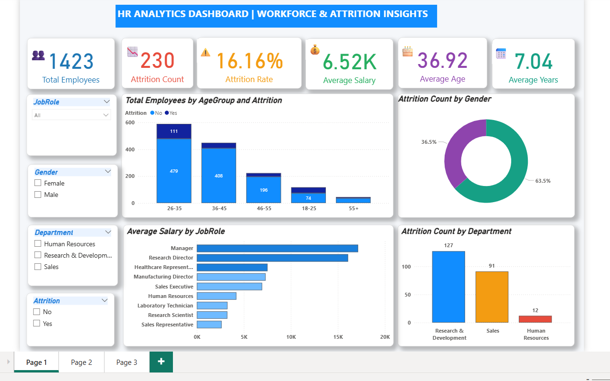
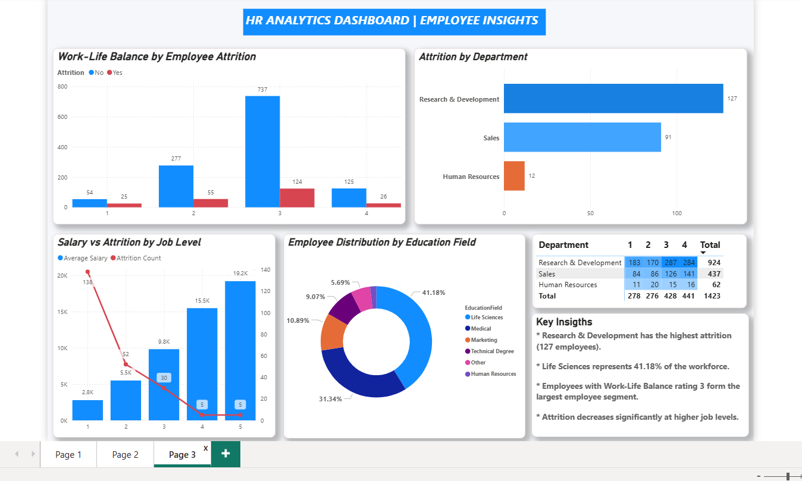
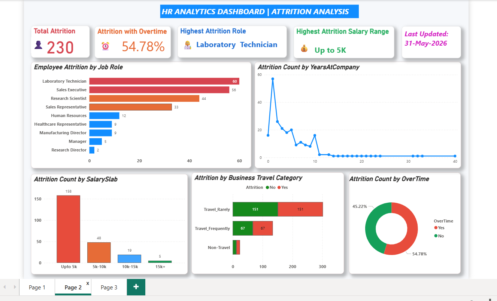

# HR-Analytics-Dashboard-PowerBI

## 📌 Project Overview

This project is an interactive **HR Analytics Dashboard** developed using **Power BI** to analyze employee attrition, workforce demographics, and organizational performance. The dashboard helps HR professionals identify attrition trends, understand workforce characteristics, and support data-driven decision-making through interactive visualizations and KPIs.

---

## 🎯 Business Problem

Employee attrition is a major challenge for organizations as it increases recruitment costs, affects productivity, and results in the loss of experienced employees. HR teams require meaningful insights to understand the factors influencing employee turnover and improve employee retention.

This dashboard provides an analytical view of employee data to uncover attrition patterns across departments, job roles, education fields, age groups, and other workforce attributes.

---

# 📷 Dashboard Preview

## 📊 Executive Dashboard

---

## 👥 Employee Demographics

---

## 📉 Attrition Analysis

---

# 📈 Key Performance Indicators (KPIs)

- Total Employees
- Attrition Count
- Attrition Rate
- Average Age
- Average Salary
- Average Years at Company

---

# 📊 Dashboard Features

### Executive Dashboard

- Workforce Overview
- Employee KPIs
- Attrition Summary
- Average Salary Analysis
- Average Experience Analysis

### Employee Analysis

- Attrition by Department
- Attrition by Job Role
- Attrition by Education Field
- Attrition by Age Group
- Attrition by Gender
- Attrition by Marital Status

### Job Satisfaction Analysis

- Job Satisfaction by Role
- Employee Performance Insights

### Interactive Filters

- Department
- Gender
- Education Field
- Job Role

---

# 🛠 Tools & Technologies

- Power BI
- Power Query
- DAX (Data Analysis Expressions)
- Microsoft Excel
- Data Modeling
- Data Visualization

---

# 📂 Dataset

The dataset includes the following employee information:

- Employee ID
- Age
- Gender
- Department
- Education Field
- Job Role
- Monthly Income
- Years at Company
- Job Satisfaction
- Work-Life Balance
- Attrition Status

---

# 💡 Key Business Insights

- Certain job roles experience significantly higher employee attrition than others.
- Employees with fewer years at the company tend to have higher turnover.
- Attrition patterns vary across departments and education fields.
- Job satisfaction plays an important role in employee retention.
- Workforce demographics provide valuable insights for HR planning and talent management.

---

# 🚀 Skills Demonstrated

- HR Analytics
- Power BI Dashboard Development
- Data Cleaning
- Data Modeling
- Data Visualization
- DAX
- Power Query
- KPI Reporting
- Business Intelligence
- Data Analysis

---

# 📁 Repository Contents

- HR_ANALYTICS_DASHBOARD.pbix
- HR_Analytics.csv
- Executive_Dashboard.png
- Employee_Demographics.png
- Attrition_Analysis.png
- README.md

---

# 🚀 How to Use

1. Download the repository.
2. Open the `.pbix` file using **Power BI Desktop**.
3. Refresh the dataset if required.
4. Explore the dashboard using interactive filters and slicers.

---

## 👩‍💻 Author

**Shaik Rubeena**

Aspiring Data Analyst
